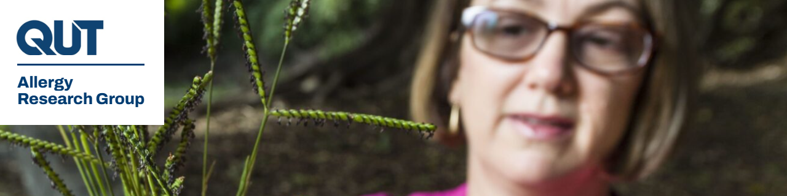

# QUT Allergy Research Group

Grass pollen allergy affects up to three million Australians with hay fever and asthma. Despite the high prevalence and burden of hay fever and asthma, recently highlighted by the tragic thunderstorm asthma epidemic, Australia is one of the few developed countries without national pollen monitoring.

Teenagers are particularly vulnerable to hay fever and asthma, which can have a major impact on their quality of life, social interactions and academic performance. The teenage years are when allergies to grass pollen emerge, and the spring peak in the grass pollen season coincides with final school examinations.

The Allergy Research Group aims to improve the lives of teenage allergy and asthma sufferers in two ways:

1. Understanding the causes of allergic rhinitis (hay fever) and seasonal asthma, leading to targeted tests and treatment for grass pollen allergy
2. Providing localised, timely information on pollen levels to help sufferers take preventative measures, including avoiding high-pollen areas such as the bush or gardens, or taking appropriate medication when going outside

## About the group

[Professor Janet Davies](https://research.qut.edu.au/ciic/people/janet-davies/) leads the Allergy Research Group, a team of researchers undertaking applied allergy research to improve diagnosis, treatment and understanding of the immunological mechanisms underlying allergic respiratory diseases.

Allergic disease affects 30% of Australians, up from 4.1 million in 2007, with rates varying by age, gender and state. Allergic disease now costs Australia $64 billion a year in health and non-financial costs (Costly Reactions, Deloitte Access Economics, 2025).

The multidisciplinary Allergy Research Group brings together molecular allergology and environmental health to improve outcomes for people living with allergic rhinitis and asthma. Janet assembled aerobiologists nationally for the NHMRC AusPollen Partnership (2016 to 2020), recognised as an [Impact Case Study by the NHMRC in 2023](https://www.nhmrc.gov.au/about-us/resources/impact-case-studies/airborne-pollen-and-respiratory-allergies-case-study), and led the guidelines for grass pollen allergy diagnosis for the EAACI Molecular Allergology User's Guide (2015 and 2022). Professor Davies is the foremost author in the Asia Pacific in the discipline of pollen allergy and climate change, and her research has been supported by 10 national competitive grants from the MRFF, NHMRC and ARC, as well as government and global industry contracts.

As the National Allergy Centre of Excellence [BioRepository and Discovery Pillar Lead](https://www.nace.org.au/research/pillar-2-biorepository-discovery/), Professor Davies oversees the design of a National Allergy BioRepository to harness big data analysis to drive individualised healthcare. As Respiratory Allergy Stream Co-Chair, she is also helping to identify the priorities of Australians living with allergic rhinitis and allergic asthma, and supporting the NACE's work in synthesising and harmonising respiratory allergy research across Australia.

## Current research

The Allergy Research Group aims to improve the lives of people living with allergic disease through world-leading research, including:

- Digitally-Integrated Smart Sensing of Diverse Airborne Grass Pollen Sources (ARC DP240203307)
- Improving Food Allergy Outcomes in Adolescents (NHMRC Clinical Trials and Cohort Studies 2023, 2032605)
- Creating A RIsk assessment biomarker Tool to prevent Seasonal allergic and Thunderstorm Asthma, CARISTA (MRFF Chronic Respiratory Conditions 2023, 2031254)
- Setting Consumer Priorities for Research in Allergic Rhinitis, in partnership with [Allergy & Anaphylaxis Australia](https://allergyfacts.org.au/news/research-update-identifying-the-main-concerns-about-allergic-rhinitis-hay-fever-to-set-research-priorities/)

## Our team

**Research staff**

- [Dr Andelija Milic](https://research.qut.edu.au/ciic/people/andelija-milic/)
- [Dr Saeideh Hajighasemi](https://research.qut.edu.au/ciic/people/saeideh-hajighasemi/)
- [Dr Karolina Bednarska](https://research.qut.edu.au/ciic/people/karolina-bednarska/)
- [Julius Agbeve](https://research.qut.edu.au/ciic/people/julius-agbeve/)

**Research students**

- [Izhar Ullah](https://research.qut.edu.au/ciic/people/izhar-ullah/)
- [Sajjad Chamani](https://research.qut.edu.au/ciic/people/sajjad-chamani/)
- [Caitlyn Dare](https://research.qut.edu.au/ciic/people/caitlyn-dare/)
- [Dhrubajyoti Das](https://research.qut.edu.au/ciic/people/dhrubajyoti-das/)

# QUT Allergy Research Group

Grass pollen allergy affects up to three million Australians with hay fever and asthma. Despite the high prevalence and burden of hay fever and asthma, recently highlighted by the tragic thunderstorm asthma epidemic, Australia is one of the few developed countries without national pollen monitoring.

Teenagers are particularly vulnerable to hay fever and asthma, which can have a major impact on their quality of life, social interactions and academic performance. The teenage years are when allergies to grass pollen emerge, and the spring peak in the grass pollen season coincides with final school examinations.

The Allergy Research Group aims to improve the lives of teenage allergy and asthma sufferers in two ways:

1. Understanding the causes of allergic rhinitis (hay fever) and seasonal asthma, leading to targeted tests and treatment for grass pollen allergy
2. Providing localised, timely information on pollen levels to help sufferers take preventative measures, including avoiding high-pollen areas such as the bush or gardens, or taking appropriate medication when going outside

## About the group

[Professor Janet Davies](https://research.qut.edu.au/ciic/people/janet-davies/) leads the Allergy Research Group, a team of researchers undertaking applied allergy research to improve diagnosis, treatment and understanding of the immunological mechanisms underlying allergic respiratory diseases.

Allergic disease affects 30% of Australians, up from 4.1 million in 2007, with rates varying by age, gender and state. Allergic disease now costs Australia $64 billion a year in health and non-financial costs (Costly Reactions, Deloitte Access Economics, 2025).

The multidisciplinary Allergy Research Group brings together molecular allergology and environmental health to improve outcomes for people living with allergic rhinitis and asthma. Janet assembled aerobiologists nationally for the NHMRC AusPollen Partnership (2016 to 2020), recognised as an [Impact Case Study by the NHMRC in 2023](https://www.nhmrc.gov.au/about-us/resources/impact-case-studies/airborne-pollen-and-respiratory-allergies-case-study), and led the guidelines for grass pollen allergy diagnosis for the EAACI Molecular Allergology User's Guide (2015 and 2022). Professor Davies is the foremost author in the Asia Pacific in the discipline of pollen allergy and climate change, and her research has been supported by 10 national competitive grants from the MRFF, NHMRC and ARC, as well as government and global industry contracts.

As the National Allergy Centre of Excellence [BioRepository and Discovery Pillar Lead](https://www.nace.org.au/research/pillar-2-biorepository-discovery/), Professor Davies oversees the design of a National Allergy BioRepository to harness big data analysis to drive individualised healthcare. As Respiratory Allergy Stream Co-Chair, she is also helping to identify the priorities of Australians living with allergic rhinitis and allergic asthma, and supporting the NACE's work in synthesising and harmonising respiratory allergy research across Australia.

## Current research

The Allergy Research Group aims to improve the lives of people living with allergic disease through world-leading research, including:

- Digitally-Integrated Smart Sensing of Diverse Airborne Grass Pollen Sources (ARC DP240203307)
- Improving Food Allergy Outcomes in Adolescents (NHMRC Clinical Trials and Cohort Studies 2023, 2032605)
- Creating A RIsk assessment biomarker Tool to prevent Seasonal allergic and Thunderstorm Asthma, CARISTA (MRFF Chronic Respiratory Conditions 2023, 2031254)
- Setting Consumer Priorities for Research in Allergic Rhinitis, in partnership with [Allergy & Anaphylaxis Australia](https://allergyfacts.org.au/news/research-update-identifying-the-main-concerns-about-allergic-rhinitis-hay-fever-to-set-research-priorities/)

## Our team

**Research staff**

- [Dr Andelija Milic](https://research.qut.edu.au/ciic/people/andelija-milic/)
- [Dr Saeideh Hajighasemi](https://research.qut.edu.au/ciic/people/saeideh-hajighasemi/)
- [Dr Karolina Bednarska](https://research.qut.edu.au/ciic/people/karolina-bednarska/)
- [Julius Agbeve](https://research.qut.edu.au/ciic/people/julius-agbeve/)

**Research students**

- [Izhar Ullah](https://research.qut.edu.au/ciic/people/izhar-ullah/)
- [Sajjad Chamani](https://research.qut.edu.au/ciic/people/sajjad-chamani/)
- [Caitlyn Dare](https://research.qut.edu.au/ciic/people/caitlyn-dare/)
- [Dhrubajyoti Das](https://research.qut.edu.au/ciic/people/dhrubajyoti-das/)

## Watch

